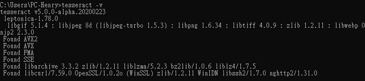

# 爬蟲 - 特約商店 - 延伸數字、文字辨識

## method 1 - Tesseract
------
* 下載Tesseract - windows
* 安裝檔: https://github.com/UB-Mannheim/tesseract/wiki
* 根據電腦位元進行選擇exe

    
* 進入系統設定添加環境變數

    
* 至cmd輸入`tesseract -v` , check是否成功

    

### 下載語言庫
------
* 英文
```
eng.traineddata
```
https://github.com/tesseract-ocr/tessdata_best/blob/main/eng.traineddata

* 繁體中文
```
chi_tra.traineddata
```
https://github.com/tesseract-ocr/tessdata_best/blob/main/chi_tra.traineddata

* 簡體中文
```
chi_sim.traineddata
```
https://github.com/tesseract-ocr/tessdata_best/blob/main/chi_sim.traineddata

### 預設路徑 - 以windows為例
------
* Tesseract 程式路徑
```
C:\Program Files\Tesseract-OCR\
```
* 語言包路徑
```
C:\Program Files\Tesseract-OCR\tessdata
```
* 下載語言包後，放到程式資料夾內的 ./tessdata 路徑，就可以生效

### Python 環境
------
* Pillow
* pytesseract
```
pip3 install Pillow
pip3 install pytesseract
```

### Python 範例
------
```py
from PIL import Image
import pytesseract
img_name = './001.en-us.png'
img = Image.open(img_name)
text = pytesseract.image_to_string(img, lang='eng')
print(text)
```

+ PIL : 處理圖片 `Pillow`
+ pytesseract : OCR 模組 `Pytesseract`
+ `img_name = './001.en-us.png'` : 圖片路徑 
+ `img = Image.open(img_name)` : 載入圖片
+ `text = pytesseract.image_to_string(img, lang='eng')` : 圖片轉文字，使用英文語系
+ `lang='chi_tra'` : 使用中文
+ `lang='chi_tra+eng'` : 使用中英文，用加號

### 錯誤事例
+ `TesseractNotFoundError: tesseract is not installed or it's not in your PATH. See README file for more information.`
http://jasonyychiu.blogspot.com/2020/09/pythonpytesseract-pytesseractpytesserac.html


## method 2 
 ```
python -m pip install -r requirements.txt
 ```
 
 
## method 3  

 ```python
python reptile_data.py
 ```

## method 4  
* 輸入帳號
* 輸入密碼
